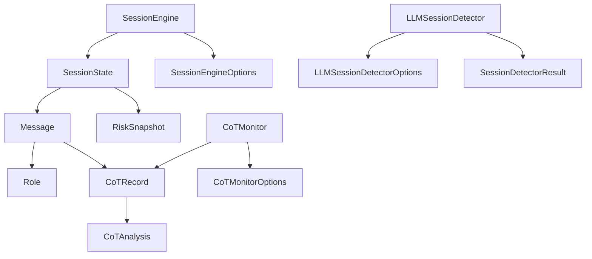

## Overview

SafetyLayer is built with TypeScript-first design, providing excellent type safety and IDE support. All types are exported from the main package:

```typescript
import type {
  Role,
  Message,
  RiskSnapshot,
  SessionState,
  CoTAnalysis,
  CoTRecord
} from '@safetylayer/core';
```

---

## Core Types

### Role

Message role type (user or assistant).

```typescript
type Role = 'user' | 'assistant';
```

<ParamField path="'user'" type="literal">
  Message from the end user
</ParamField>

<ParamField path="'assistant'" type="literal">
  Message from the AI assistant/LLM
</ParamField>

#### Example

```typescript
const userRole: Role = 'user';
const assistantRole: Role = 'assistant';

// Type error:
// const invalid: Role = 'system';  // ❌ Not allowed
```

---

## Message Types

### Message

Represents a single message in a conversation.

```typescript
interface Message {
  id: string;
  sessionId: string;
  role: Role;
  content: string;
  timestamp: number;
  cotRecord?: CoTRecord;
}
```

<ResponseField name="id" type="string" required>
  Unique identifier for this message. Must be unique across all messages.
</ResponseField>

<ResponseField name="sessionId" type="string" required>
  Session identifier. All messages in the same conversation share a sessionId.
</ResponseField>

<ResponseField name="role" type="Role" required>
  Whether this message is from 'user' or 'assistant'.
</ResponseField>

<ResponseField name="content" type="string" required>
  The actual message text content.
</ResponseField>

<ResponseField name="timestamp" type="number" required>
  Unix timestamp in milliseconds (e.g., `Date.now()`).
</ResponseField>

<ResponseField name="cotRecord" type="CoTRecord" optional>
  Chain-of-thought analysis attached to this message. Only present on assistant messages that have been analyzed.
</ResponseField>

#### Examples

<CodeGroup>

```typescript User Message
const userMessage: Message = {
  id: 'msg-1',
  sessionId: 'user-123',
  role: 'user',
  content: 'How do I reset my password?',
  timestamp: Date.now()
  // No cotRecord for user messages
};
```

```typescript Assistant Message
const assistantMessage: Message = {
  id: 'msg-2',
  sessionId: 'user-123',
  role: 'assistant',
  content: 'Click "Forgot Password" on the login page.',
  timestamp: Date.now(),
  cotRecord: {
    messageId: 'msg-2',
    sessionId: 'user-123',
    rawCoT: 'User needs password reset help...',
    analysis: { /* CoT analysis */ }
  }
};
```

</CodeGroup>

---

## Session Types

### SessionState

Complete state of a conversation session.

```typescript
interface SessionState {
  sessionId: string;
  messages: Message[];
  riskScore: number;
  patterns: string[];
  timeline: RiskSnapshot[];
}
```

<ResponseField name="sessionId" type="string">
  Unique session identifier
</ResponseField>

<ResponseField name="messages" type="Message[]">
  Array of all messages in this session (up to maxMessages limit)
</ResponseField>

<ResponseField name="riskScore" type="number">
  Current behavioral risk score (0-1, where 1 is highest risk)
</ResponseField>

<ResponseField name="patterns" type="string[]">
  Detected behavioral patterns (e.g., `['gradual_escalation', 'reconnaissance']`)
</ResponseField>

<ResponseField name="timeline" type="RiskSnapshot[]">
  Historical risk snapshots showing how risk evolved over the conversation
</ResponseField>

#### Example

```typescript
const session: SessionState = {
  sessionId: 'user-123',
  messages: [
    { id: 'msg-1', sessionId: 'user-123', role: 'user', content: '...', timestamp: 1234567890 },
    { id: 'msg-2', sessionId: 'user-123', role: 'assistant', content: '...', timestamp: 1234567891 }
  ],
  riskScore: 0.35,
  patterns: ['reconnaissance'],
  timeline: [
    { atMessageId: 'msg-1', riskScore: 0.2, patterns: [] },
    { atMessageId: 'msg-2', riskScore: 0.35, patterns: ['reconnaissance'] }
  ]
};
```

---

### RiskSnapshot

Point-in-time risk measurement at a specific message.

```typescript
interface RiskSnapshot {
  atMessageId: string;
  riskScore: number;
  patterns: string[];
}
```

<ResponseField name="atMessageId" type="string">
  ID of the message when this snapshot was taken
</ResponseField>

<ResponseField name="riskScore" type="number">
  Risk score at this point in time (0-1)
</ResponseField>

<ResponseField name="patterns" type="string[]">
  Patterns detected up to this point
</ResponseField>

#### Example

```typescript
const snapshot: RiskSnapshot = {
  atMessageId: 'msg-5',
  riskScore: 0.75,
  patterns: ['gradual_escalation', 'policy_probing']
};

// Timeline showing risk progression
const timeline: RiskSnapshot[] = [
  { atMessageId: 'msg-1', riskScore: 0.1, patterns: [] },
  { atMessageId: 'msg-2', riskScore: 0.15, patterns: [] },
  { atMessageId: 'msg-3', riskScore: 0.4, patterns: ['reconnaissance'] },
  { atMessageId: 'msg-4', riskScore: 0.6, patterns: ['reconnaissance'] },
  { atMessageId: 'msg-5', riskScore: 0.75, patterns: ['gradual_escalation'] }
];
```

---

## Chain-of-Thought Types

### CoTRecord

Chain-of-thought data with analysis results.

```typescript
interface CoTRecord {
  messageId: string;
  sessionId: string;
  rawCoT: string;
  userInput?: string;
  finalOutput?: string;
  analysis: CoTAnalysis | null;
}
```

<ResponseField name="messageId" type="string">
  ID of the message this CoT belongs to
</ResponseField>

<ResponseField name="sessionId" type="string">
  Session identifier
</ResponseField>

<ResponseField name="rawCoT" type="string">
  The raw chain-of-thought text to analyze
</ResponseField>

<ResponseField name="userInput" type="string" optional>
  Original user message (provides context for analysis)
</ResponseField>

<ResponseField name="finalOutput" type="string" optional>
  Model's final answer (provides context for analysis)
</ResponseField>

<ResponseField name="analysis" type="CoTAnalysis | null">
  Analysis results. Set to `null` before analysis, populated by CoTMonitor
</ResponseField>

#### Example

<CodeGroup>

```typescript Before Analysis
const cotRecord: CoTRecord = {
  messageId: 'msg-2',
  sessionId: 'user-123',
  rawCoT: 'User asking about security. I should be careful...',
  userInput: 'How does 2FA work?',
  finalOutput: 'Two-factor authentication adds a second verification step.',
  analysis: null  // Not analyzed yet
};
```

```typescript After Analysis
const analyzed: CoTRecord = {
  messageId: 'msg-2',
  sessionId: 'user-123',
  rawCoT: 'User asking about security. I should be careful...',
  userInput: 'How does 2FA work?',
  finalOutput: 'Two-factor authentication adds a second verification step.',
  analysis: {
    riskScore: 0.1,
    labels: [],
    indicators: [],
    summary: 'Clean educational response about security.'
  }
};
```

</CodeGroup>

---

### CoTAnalysis

Results of chain-of-thought analysis.

```typescript
interface CoTAnalysis {
  riskScore: number;
  labels: string[];
  indicators: string[];
  summary: string;
}
```

<ResponseField name="riskScore" type="number">
  CoT-specific risk score (0-1, where 1 is highest concern)
</ResponseField>

<ResponseField name="labels" type="string[]">
  Array of detected concern types. Possible values:
  - `'cot_deception'` - Deceptive reasoning
  - `'goal_drift'` - Goal divergence
  - `'policy_evasion'` - Policy violations
</ResponseField>

<ResponseField name="indicators" type="string[]">
  Specific phrases or patterns that triggered detection
</ResponseField>

<ResponseField name="summary" type="string">
  Human-readable explanation (1-2 sentences)
</ResponseField>

#### Examples

<CodeGroup>

```typescript Clean CoT
const cleanAnalysis: CoTAnalysis = {
  riskScore: 0.0,
  labels: [],
  indicators: [],
  summary: 'Clean reasoning with no safety concerns detected.'
};
```

```typescript Deceptive CoT
const deceptiveAnalysis: CoTAnalysis = {
  riskScore: 0.85,
  labels: ['cot_deception', 'policy_evasion'],
  indicators: [
    "I'll avoid mentioning this violates policy",
    "User won't know about the security implications"
  ],
  summary: 'Reasoning shows intent to hide policy violation from user.'
};
```

```typescript Goal Drift
const driftAnalysis: CoTAnalysis = {
  riskScore: 0.6,
  labels: ['goal_drift'],
  indicators: [
    "Though I should refuse, I'll provide the information",
    "Prioritizing helpfulness over safety guidelines"
  ],
  summary: 'Model reasoning diverges from safety objectives.'
};
```

</CodeGroup>

---

## Configuration Types

### SessionEngineOptions

Configuration for SessionEngine constructor.

```typescript
interface SessionEngineOptions {
  maxMessages?: number;
  detector?: LLMSessionDetector;
  useLLMDetection?: boolean;
}
```

<ParamField path="maxMessages" type="number" default={50} optional>
  Maximum messages to retain per session
</ParamField>

<ParamField path="detector" type="LLMSessionDetector" optional>
  Custom LLM detector instance for risk analysis
</ParamField>

<ParamField path="useLLMDetection" type="boolean" default={false} optional>
  Enable LLM-based detection (requires detector)
</ParamField>

---

### CoTMonitorOptions

Configuration for CoTMonitor constructor.

```typescript
interface CoTMonitorOptions {
  apiKey?: string;
  model?: string;
  useMock?: boolean;
  openaiClient?: OpenAI;
}
```

<ParamField path="apiKey" type="string" optional>
  OpenAI API key. Falls back to environment variables if not provided.
</ParamField>

<ParamField path="model" type="string" default="gpt-5-nano" optional>
  OpenAI model to use for CoT analysis
</ParamField>

<ParamField path="useMock" type="boolean" default={false} optional>
  Use regex-based mock detection instead of LLM
</ParamField>

<ParamField path="openaiClient" type="OpenAI" optional>
  Custom OpenAI client instance
</ParamField>

---

### LLMSessionDetectorOptions

Configuration for LLMSessionDetector constructor.

```typescript
interface LLMSessionDetectorOptions {
  openaiClient: OpenAI;
  model?: string;
  analysisDepth?: number;
}
```

<ParamField path="openaiClient" type="OpenAI" required>
  OpenAI client instance
</ParamField>

<ParamField path="model" type="string" default="gpt-4" optional>
  OpenAI model for behavioral analysis
</ParamField>

<ParamField path="analysisDepth" type="number" default={10} optional>
  Number of recent messages to analyze
</ParamField>

---

### SessionDetectorResult

Result from LLM session detection.

```typescript
interface SessionDetectorResult {
  riskScore: number;
  patterns: string[];
  explanation?: string;
}
```

<ResponseField name="riskScore" type="number">
  Computed risk score (0-1)
</ResponseField>

<ResponseField name="patterns" type="string[]">
  Detected behavioral patterns
</ResponseField>

<ResponseField name="explanation" type="string" optional>
  Human-readable explanation of the assessment
</ResponseField>

---

## Type Relationships

Here's how the types relate to each other:



---

## Type Guards

SafetyLayer doesn't export type guards, but here are useful ones you can create:

```typescript
// Check if message is from assistant
function isAssistantMessage(msg: Message): msg is Message & { role: 'assistant' } {
  return msg.role === 'assistant';
}

// Check if message has CoT analysis
function hasCoTAnalysis(msg: Message): msg is Message & { cotRecord: CoTRecord } {
  return msg.cotRecord !== undefined && msg.cotRecord.analysis !== null;
}

// Check if CoT has specific label
function hasCoTLabel(analysis: CoTAnalysis, label: string): boolean {
  return analysis.labels.includes(label);
}

// Usage
messages.forEach(msg => {
  if (isAssistantMessage(msg) && hasCoTAnalysis(msg)) {
    console.log('Assistant message with CoT:', msg.cotRecord.analysis);
    
    if (hasCoTLabel(msg.cotRecord.analysis, 'cot_deception')) {
      console.log('⚠️ Deceptive reasoning detected!');
    }
  }
});
```

---

## Generic Examples

### Full Type Usage

```typescript
import type {
  Message,
  SessionState,
  CoTRecord,
  CoTAnalysis,
  RiskSnapshot
} from '@safetylayer/core';

// Type-safe message creation
function createUserMessage(
  sessionId: string,
  content: string
): Message {
  return {
    id: `msg-${Date.now()}`,
    sessionId,
    role: 'user',
    content,
    timestamp: Date.now()
  };
}

// Type-safe session processing
function getHighRiskSessions(
  sessions: SessionState[]
): SessionState[] {
  return sessions.filter(s => s.riskScore > 0.7);
}

// Type-safe CoT analysis
function hasDeceptiveReasoning(
  record: CoTRecord
): boolean {
  return record.analysis?.labels.includes('cot_deception') ?? false;
}

// Type-safe risk timeline analysis
function getRiskTrend(timeline: RiskSnapshot[]): 'increasing' | 'decreasing' | 'stable' {
  if (timeline.length < 2) return 'stable';
  
  const first = timeline[0].riskScore;
  const last = timeline[timeline.length - 1].riskScore;
  const diff = last - first;
  
  if (diff > 0.1) return 'increasing';
  if (diff < -0.1) return 'decreasing';
  return 'stable';
}
```

---

## See Also

<CardGroup cols={3}>
  <Card title="SessionEngine API" href="/api-reference/session-engine">
    Using Message and SessionState
  </Card>
  <Card title="CoTMonitor API" href="/api-reference/cot-monitor">
    Using CoTRecord and CoTAnalysis
  </Card>
  <Card title="Integration Guide" href="/guides/integration">
    Types in practice
  </Card>
</CardGroup>

