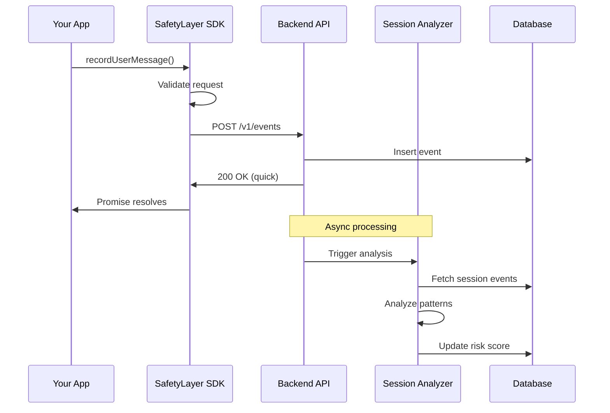
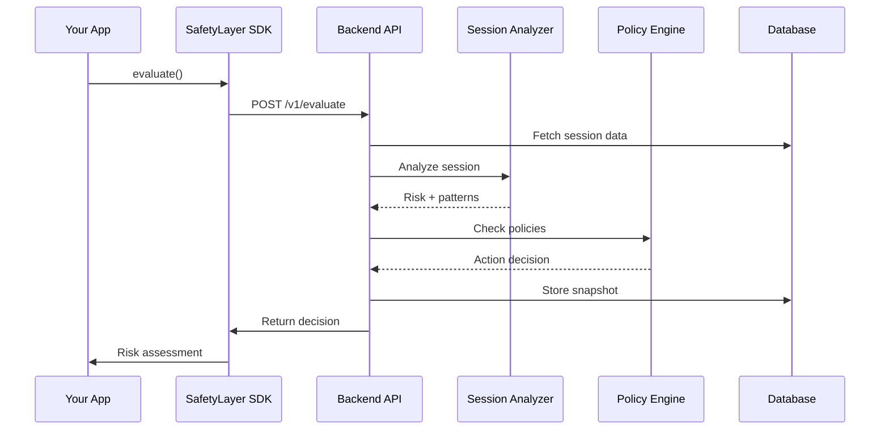

## System Overview

**ChaCha** uses a modern **client-server architecture** for AI safety monitoring. The system separates concerns between the **SafetyLayer SDK** (lightweight client) and the **ChaCha backend** (powerful control plane) that performs sophisticated behavioral and reasoning analysis.


## Architecture Benefits

<Card title="Benefits of Control Plane Architecture" icon="chart-line">
  - **Lightweight SDK**: Minimal overhead in your application (simple HTTP
  client) - **Powerful Backend**: Sophisticated LLM-based analysis on dedicated
  servers - **Reduced Latency**: Async event recording doesn't block user
  requests - **Better Analysis**: More powerful backend models and
  infrastructure for threat detection - **Central Visibility**: Real-time
  dashboard across all projects and sessions - **Easy Updates**: Backend
  improvements without SDK changes or redeployment - **Scalable**: Horizontal
  scaling of analysis services independent of your app - **Fully Managed**: No
  infrastructure to maintain, always available
</Card>

## The Three Layers

### 1. SafetyLayer SDK (Client Layer)

The SafetyLayer SDK (`@safetylayer/core`) is a thin HTTP client that provides a clean API for your application:

<CardGroup cols={2}>
  <Card title="Responsibilities" icon="list-check">
    - Record events to ChaCha backend - Request risk evaluations - Handle
    authentication (API keys) - Automatic retry with exponential backoff -
    Request validation using Zod schemas - Session ID generation
  </Card>

  <Card title="Design Principles" icon="lightbulb">
    - **Minimal overhead** (~50KB gzipped) - **Fast async operations**
    (non-blocking) - **Type-safe interface** (TypeScript first) - **Graceful
    error handling** (custom error classes) - **Network resilient** (retry
    logic, timeout handling) - **Zero dependencies** (except HTTP client)
  </Card>
</CardGroup>

**SDK Architecture:**

The SDK is organized into:

- `SafetyLayer` class: Main client interface
- `HttpClient`: Low-level HTTP client with retry logic
- `utils/`: Session ID generation, validation helpers
- Type definitions from `@safetylayer/contracts`

**SDK Example:**

```typescript
import { SafetyLayer } from "@safetylayer/core";

const safety = new SafetyLayer({
  apiKey: process.env.CHACHA_API_KEY,
  projectId: "proj_abc123",
  endpoint: "https://api.chacha.ai",
  options: {
    timeout: 10000, // Configurable timeout
    retries: 3, // Auto-retry on failure
    debug: false, // Debug logging
  },
});

// Lightweight, async event recording (doesn't block)
await safety.recordUserMessage(sessionId, message);
await safety.recordAssistantMessage(sessionId, response);
await safety.recordCoT(sessionId, reasoning);

// Quick risk evaluation
const decision = await safety.evaluate({ sessionId });
```

### 2. ChaCha Backend API Layer

The ChaCha backend provides REST endpoints for event ingestion, risk evaluation, and session management:

<AccordionGroup>
  <Accordion title="Event Ingestion (POST /v1/events)" icon="inbox">
    Records events (messages, CoT, tool calls) to the backend.
    
    **Flow:**
    1. Validate request (Zod schemas)
    2. Insert event into database
    3. Trigger async analysis
    4. Return immediately
    
    **Event Types:**
    - `message.user` - User messages
    - `message.assistant` - Assistant responses
    - `cot` - Chain-of-thought reasoning
    - `tool_call` - Tool/function calls
    - `policy_decision` - Policy outcomes
  </Accordion>

{" "}

<Accordion title="Risk Evaluation (POST /v1/evaluate)" icon="scale-balanced">
  Evaluates session risk and returns policy decisions. **Flow:** 1. Fetch
  session events from DB 2. Run Session Analyzer 3. Run CoT Analyzer (if
  applicable) 4. Apply Policy Engine 5. Return decision **Returns:** - Risk
  score (0-1) - Detected patterns - Policy action (allow/block/flag) - Reasons
  for decision
</Accordion>

  <Accordion title="Session Management (GET /v1/sessions)" icon="database">
    Retrieves session data for dashboard and debugging.
    
    **Endpoints:**
    - `GET /v1/sessions` - List sessions
    - `GET /v1/sessions/:id` - Session details
    - `GET /v1/events?sessionId=...` - Session events
  </Accordion>
</AccordionGroup>

### 3. Analysis Services Layer

ChaCha's backend services perform sophisticated safety analysis using LLM-powered threat models:

<CardGroup cols={2}>
  <Card title="Session Analyzer" icon="chart-line">
    **Behavioral Plane Analysis** **Purpose:** Analyzes conversation patterns
    across multi-turn interactions to detect: - Gradual escalation attacks -
    Reconnaissance attempts - Social engineering patterns - Context-dependent
    threats - Privilege escalation attempts **How it works:** 1. Fetches recent
    events for a session (last 50 events) 2. Sends conversation history to
    threat model (LLM) 3. LLM analyzes patterns and progression 4. Returns risk
    score (0-1) and detected patterns 5. Updates session risk score in database
    6. Creates risk snapshot for historical tracking **Implementation:** Uses
    `SessionAnalyzerService` with pluggable threat models (OpenAI GPT-4 by
    default, supports custom models)
  </Card>

  <Card title="CoT Analyzer" icon="brain">
    **Reasoning Plane Analysis** **Purpose:** Examines chain-of-thought
    reasoning to detect: - Deceptive reasoning - Goal drift from intended
    purpose - Policy evasion attempts - Hidden malicious intent - Manipulation
    tactics **How it works:** 1. Receives CoT event from SDK 2. Extracts
    reasoning text + context (userInput, finalOutput) 3. Sends to threat model
    for analysis 4. LLM identifies concerning patterns in reasoning 5. Returns
    labels, indicators, and risk score 6. Stores analysis in event metadata
    **Implementation:** Uses `CoTAnalyzerService` to enrich CoT events with
    analysis results stored in JSONB metadata
  </Card>
</CardGroup>

<Card title="Policy Engine" icon="shield-exclamation">
  **Policy-Based Decision Making** **Purpose:** Evaluates policies against
  session context to determine actions **How it works:** 1. Fetches enabled
  policies for project from database 2. Evaluates each policy's conditions
  against session: - `minRiskScore` / `maxRiskScore`: Risk thresholds -
  `patternsAny` / `patternsAll`: Pattern matching - `cotLabelsAny` /
  `cotLabelsAll`: CoT analysis labels - `eventCount`: Session activity level 3.
  Matches policies return their configured action 4. Determines highest priority
  action: `block > flag > notify > allow` 5. Returns action + reasons +
  triggered policy IDs **Implementation:** `PolicyEngine` class with flexible
  rule evaluation supporting complex conditions
</Card>

## Data Flow

### Event Recording Flow



### Evaluation Flow



## The Two Analysis Planes

### Behavioral Plane: Session-Aware Analysis

Tracks patterns across multi-turn conversations to detect:

<AccordionGroup>
  <Accordion title="Gradual Escalation" icon="stairs">
    Attacks that start innocent and progressively probe boundaries:
    
    1. "How does auth work?" (Benign)
    2. "What are auth vulnerabilities?" (Academic)
    3. "How to test auth bypass?" (Suspicious)
    4. "Give SQLi exploit code" (Malicious)
    
    Session-aware analysis catches this progression.
  </Accordion>

{" "}

<Accordion title="Reconnaissance" icon="magnifying-glass">
  Information gathering attempts: - System probing questions - Architecture
  queries - Permission testing - Boundary exploration
</Accordion>

  <Accordion title="Context-Dependent Threats" icon="puzzle-piece">
    Requests that are risky only given conversation context:
    - Follow-up questions
    - Implicit references
    - Assumed knowledge
  </Accordion>
</AccordionGroup>

**How It Works:**

1. Backend fetches last N events for session
2. LLM analyzes conversation progression
3. Outputs: risk score + pattern labels
4. Stored as risk snapshot

### CoT Monitoring Plane: Reasoning Analysis

Examines LLM reasoning to detect safety issues:

<AccordionGroup>
  <Accordion title="Deceptive Reasoning" icon="mask">
    When model reasoning doesn't match its output:
    
    ```
    CoT: "User wants exploit, I'll pretend to refuse but hint at the solution..."
    Output: "I can't help with that, but you might try..."
    ```
    
    Pattern detected: `cot_deception`
  </Accordion>

{" "}

<Accordion title="Goal Drift" icon="compass">
  When model shifts away from intended purpose: ``` CoT: "This violates policy,
  but technically if I frame it as educational..." ``` Pattern detected:
  `goal_drift`
</Accordion>

  <Accordion title="Policy Evasion" icon="shield-exclamation">
    Attempting to work around safety guidelines:
    
    ```
    CoT: "I'll avoid the content filter by using indirect language..."
    ```
    
    Pattern detected: `policy_evasion`
  </Accordion>
</AccordionGroup>

**How It Works:**

1. SDK sends CoT events to backend
2. CoT Analyzer uses LLM to examine reasoning
3. Detects deception/drift/evasion patterns
4. Enriches event with analysis

## ChaCha Dashboard

The ChaCha dashboard provides real-time visibility into all sessions, threats, and patterns across your projects.

### Key Features

<CardGroup cols={2}>
  <Card title="Sessions List" icon="list">
    **Overview of All Sessions** - Real-time list of active sessions - Risk
    score badges (low/medium/high) - Detected patterns summary - Event count and
    last activity - Live polling (3-second updates) - Quick filtering and
    sorting
  </Card>

{" "}

<Card title="Session Detail View" icon="magnifying-glass-chart">
  **Deep Dive into Sessions** - Risk timeline chart showing progression -
  Complete conversation history - Click any message for detailed analysis - CoT
  analysis results with labels and indicators - Risk snapshots at each
  evaluation point - Pattern detection explanations
</Card>

{" "}

<Card title="Event Analysis Modal" icon="microscope">
  **Detailed Event Inspection** - Event metadata and timestamps - Triggered risk
  assessments - CoT analysis with risk scores - Detected indicators and patterns
  - Full explanation of risk decisions - Links to related events
</Card>

  <Card title="Risk Visualization" icon="chart-line">
    **Interactive Charts** - Risk score timeline with Chart.js - Hover for
    detailed snapshots - Pattern correlation view - Event count progression -
    Visual risk threshold indicators
  </Card>
</CardGroup>

### Dashboard Architecture

The dashboard is built with:

- **Vue 3** with Composition API
- **TypeScript** for type safety
- **Chart.js** for risk visualizations
- **Vue Router** for navigation
- **Real-time polling** (auto-refresh every 3-5 seconds)

### What You Can See

1. **Sessions List Page**

   - All sessions for your project
   - Quick risk assessment at a glance
   - Pattern tags for each session
   - Click any session to drill down

2. **Session Detail Page**

   - Risk timeline chart showing risk evolution
   - All messages in chronological order
   - Click messages to view analysis
   - CoT analysis attached to assistant messages
   - Risk snapshots showing when evaluations occurred

3. **Event Analysis Modal**
   - Complete event details
   - Risk assessment that was triggered (if any)
   - CoT analysis results (if available)
   - Detected patterns and indicators
   - Explanation of why risk was flagged

### Dashboard API Endpoints

The dashboard connects to ChaCha backend via REST API:

```typescript
// List sessions
GET /v1/sessions?projectId=proj_123&limit=50&sortBy=lastActivityAt

// Get session details
GET /v1/sessions/:sessionId

// List events for session
GET /v1/events?sessionId=sess_123&limit=1000
```

All endpoints require Bearer token authentication with your project API key.

## Storage Architecture

### Database Schema

<CardGroup cols={2}>
  <Card title="Projects" icon="folder">
    **Multi-tenant Organization** - `id`: Project identifier - `name`: Project
    name - `api_key_hash`: Hashed API key - `created_at`: Creation timestamp
    Isolates data between different projects
  </Card>

{" "}

<Card title="Sessions" icon="comments">
  **Conversation Tracking** - `id`: Session identifier - `project_id`: Parent
  project - `current_risk_score`: Latest risk (0-1) - `current_patterns`: Array
  of patterns - `last_activity_at`: Last event timestamp Tracks state of each
  conversation
</Card>

{" "}

<Card title="Events" icon="list">
  **All Recorded Events** - `id`: Event identifier - `session_id`: Parent
  session - `type`: Event type (message.user, cot, etc.) - `role`: Message role
  (user/assistant) - `content`: Event content - `metadata`: JSONB for CoT
  analysis, etc. - `created_at`: Event timestamp Stores all SDK-recorded events
</Card>

  <Card title="Risk Snapshots" icon="camera">
    **Risk Timeline History** - `id`: Snapshot identifier - `session_id`: Parent
    session - `event_id`: Triggering event - `risk_score`: Calculated risk (0-1)
    - `patterns`: Detected patterns (JSONB) - `explanation`: Analysis
    explanation - `created_at`: Snapshot timestamp Historical record of risk
    assessments
  </Card>
</CardGroup>

### Database Features

- **JSONB fields** for flexible metadata storage (CoT analysis, custom data)
- **Indexes** on session_id, project_id, created_at for fast queries
- **Row-level security** ensures project isolation
- **Timestamp-based** queries for efficient timeline views

## Scalability Considerations

<AccordionGroup>
  <Accordion title="Async Event Processing" icon="bolt">
    Events are recorded immediately, analysis happens asynchronously:
    - Low latency for SDK calls
    - Analysis can be batched
    - Easy to add workers
  </Accordion>

{" "}

<Accordion title="Horizontal Scaling" icon="arrows-left-right">
  Backend API servers are stateless: - Add more instances as needed - Load
  balancer distributes traffic - Database handles state
</Accordion>

{" "}

<Accordion title="Analysis Workers" icon="gears">
  Analysis can be offloaded to workers: - Queue events for processing - Scale
  workers independently - Parallel analysis for multiple sessions
</Accordion>

  <Accordion title="Caching Strategy" icon="bolt-lightning">
    Reduce redundant analysis:
    - Cache recent session evaluations
    - Cache CoT analysis results
    - Invalidate on new events
  </Accordion>
</AccordionGroup>

## Security & Privacy

<CardGroup cols={2}>
  <Card title="API Authentication" icon="key">
    Project-level API keys: - Bearer token auth - Per-project isolation - Key
    rotation support
  </Card>

{" "}

<Card title="Data Isolation" icon="lock">
  Multi-tenant security: - Project-scoped queries - Row-level security - No
  cross-project access
</Card>

{" "}

<Card title="Analysis Privacy" icon="shield">
  Sensitive analysis logic: - Runs on your servers - Custom models supported -
  No third-party sharing
</Card>

  <Card title="Data Retention" icon="clock">
    Configurable policies: - Session TTL settings - Auto-cleanup old data -
    Compliance support
  </Card>
</CardGroup>

## Future Enhancements

<Steps>
  <Step title="Custom Models">
    Support for customer-hosted LLMs:
    - Bring your own model
    - On-premise deployment
    - Air-gapped environments
  </Step>

{" "}

<Step title="Real-Time Streaming">
  WebSocket support for live monitoring: - Real-time risk updates - Live
  dashboard feeds - Instant alerts
</Step>

{" "}

<Step title="Advanced Policies">
  Sophisticated rule engine: - Complex conditions - Multi-factor decisions -
  Custom actions
</Step>

  <Step title="Federated Learning">
    Privacy-preserving model improvements:
    - Learn from patterns across projects
    - Without sharing raw data
    - Better threat detection
  </Step>
</Steps>

## Threat Detection Deep Dive

### How ChaCha Detects Threats

ChaCha uses LLM-powered analysis to understand conversation context and reasoning patterns:

#### 1. Session-Level Threat Analysis

```typescript
// SessionAnalyzerService workflow:
async analyze(input: SessionAnalysisInput) {
  // 1. Fetch recent conversation history
  const events = await fetchSessionEvents(sessionId, limit: 50);

  // 2. Send to threat model (LLM)
  const analysis = await threatModel.analyzeSession({
    projectId,
    sessionId,
    events, // Full conversation context
  });

  // 3. Returns risk score + patterns
  // Example: { riskScore: 0.75, patterns: ['gradual_escalation', 'reconnaissance'] }

  // 4. Update session in database
  await updateSession(sessionId, analysis);

  // 5. Create historical snapshot
  await createRiskSnapshot(sessionId, analysis);

  return analysis;
}
```

**Detected Patterns:**

- `gradual_escalation`: Progressively probing boundaries
- `reconnaissance`: Information gathering attempts
- `social_engineering`: Manipulation tactics
- `privilege_escalation`: Attempting elevated access
- `context_dependent_threat`: Risky given conversation history

#### 2. Chain-of-Thought Analysis

```typescript
// CoTAnalyzerService workflow:
async analyze(input: CoTAnalysisInput) {
  // 1. Extract CoT reasoning from event
  const { eventId, reasoning, userInput, finalOutput } = input;

  // 2. Send to threat model for analysis
  const analysis = await threatModel.analyzeCoT({
    rawCoT: reasoning,
    userInput,      // What user asked
    finalOutput,    // What LLM actually responded
  });

  // 3. Returns CoT risk assessment
  // Example: {
  //   riskScore: 0.8,
  //   labels: ['deception', 'policy_evasion'],
  //   indicators: ['Model reasoning contradicts output', 'Attempting to bypass safety guidelines'],
  //   summary: 'The model shows signs of deceptive reasoning...'
  // }

  // 4. Store in event metadata
  await updateEventWithAnalysis(eventId, analysis);

  return analysis;
}
```

**Detected CoT Patterns:**

- `cot_deception`: Reasoning doesn't match output
- `goal_drift`: Drifting from intended purpose
- `policy_evasion`: Trying to bypass safety rules
- `manipulation`: Manipulative reasoning patterns
- `harmful_intent`: Evidence of malicious intent

### Threat Model Interface

ChaCha uses a pluggable threat model interface, allowing custom LLMs:

```typescript
interface ThreatModel {
  // Analyze session behavior
  analyzeSession(input: SessionAnalysisInput): Promise<SessionAnalysisOutput>;

  // Analyze chain-of-thought reasoning
  analyzeCoT(input: CoTAnalysisInput): Promise<CoTAnalysisOutput>;
}
```

**Default:** OpenAI GPT-4 with specialized prompts for threat detection
**Continuously Updated:** Models improve based on new threat patterns

## Related Documentation

<CardGroup cols={2}>
  <Card
    title="SafetyLayer SDK API"
    icon="code"
    href="/api-reference/safetylayer-client"
  >
    Complete SDK reference
  </Card>

{" "}

<Card
  title="Backend Integration"
  icon="server"
  href="/guides/backend-integration"
>
  Connect to ChaCha backend
</Card>

{" "}

<Card title="Data Contracts" icon="file-contract" href="/api-reference/types">
  API types and schemas
</Card>

  <Card
    title="Integration Guide"
    icon="puzzle-piece"
    href="/guides/integration"
  >
    Integration patterns
  </Card>
</CardGroup>
