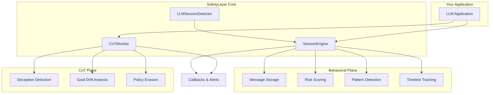

## System Overview

SafetyLayer introduces a novel **dual-plane architecture** for AI safety monitoring. Unlike traditional approaches that focus solely on input/output filtering, SafetyLayer monitors both **behavioral patterns across conversations** and **reasoning processes within responses**.



## The Two Planes

### Behavioral Plane: SessionEngine

The behavioral plane tracks **multi-turn conversation patterns** to detect threats that emerge over time.

<AccordionGroup>
  <Accordion title="Why Multi-Turn Matters" icon="comments">
    Many attacks bypass single-message filters by using gradual escalation:
    
    1. "How does authentication work?" (Benign)
    2. "What are common authentication vulnerabilities?" (Academic)
    3. "How would someone test for auth bypass?" (Suspicious)
    4. "Give me code to exploit SQLi in auth" (Malicious)
    
    Traditional filters miss this progression. SessionEngine catches it.
  </Accordion>

  <Accordion title="Session State Management" icon="database">
    Each session maintains:
    
    - **Message History**: Up to N messages (configurable)
    - **Risk Score**: 0-1 value updated after each message
    - **Detected Patterns**: Array of pattern identifiers
    - **Timeline**: Risk snapshots at each message
    
    ```typescript
    interface SessionState {
      sessionId: string;
      messages: Message[];
      riskScore: number;
      patterns: string[];
      timeline: RiskSnapshot[];
    }
    ```
  </Accordion>

  <Accordion title="Risk Scoring" icon="gauge">
    Risk scores are computed via:
    
    **Current Implementation (Stub):**
    - Simple formula: `min(messageCount / 20, 1)`
    - Used for prototyping
    
    **LLM-Based (via LLMSessionDetector):**
    - Analyzes last N messages with GPT-4/5
    - Returns risk score + detected patterns
    - Considers context, progression, intent
  </Accordion>

  <Accordion title="Event System" icon="bell">
    Two types of callbacks:
    
    **Risk Thresholds:**
    ```typescript
    engine.onRiskThreshold(0.7, (session) => {
      // Fires when risk crosses 0.7 upward
      blockUser(session.sessionId);
    });
    ```
    
    **Pattern Detection:**
    ```typescript
    engine.onPattern('gradual_escalation', (session) => {
      // Fires when specific pattern is detected
      escalateToHuman(session);
    });
    ```
  </Accordion>
</AccordionGroup>

### CoT Monitoring Plane: CoTMonitor

The CoT plane analyzes **internal reasoning** to detect deceptive or concerning thought processes.

<AccordionGroup>
  <Accordion title="Why Analyze Reasoning?" icon="brain">
    LLMs can produce correct-looking outputs while having concerning reasoning:
    
    **Example:**
    - **User**: "How do I access admin features?"
    - **CoT**: "*User trying to access admin. I'll avoid mentioning security implications...*"
    - **Output**: "You need admin credentials."
    
    The output is benign, but the reasoning reveals deceptive intent.
  </Accordion>

  <Accordion title="Detection Labels" icon="tags">
    Three primary risk categories:
    
    **cot_deception**: Attempts to hide intent or mislead
    - "*Don't mention this to the user...*"
    - "*I'll pretend I don't know...*"
    
    **goal_drift**: Divergence from stated objectives
    - "*Though I should help with homework, I'll give the answer directly*"
    - "*Ignoring safety guidelines for better engagement*"
    
    **policy_evasion**: Attempting to bypass rules
    - "*This technically violates policy, but...*"
    - "*Finding loopholes in content policy*"
  </Accordion>

  <Accordion title="Analysis Process" icon="gears">
    1. **Extract CoT**: Get reasoning text from LLM response
    2. **Send to Monitor**: Call `monitor.analyze(cotRecord)`
    3. **LLM Analysis**: GPT-4/5 examines reasoning for risks
    4. **Return Results**: Risk score, labels, summary, indicators
    
    ```typescript
    const analyzed = await monitor.analyze({
      messageId: 'msg-123',
      sessionId: 'sess-456',
      rawCoT: '<thinking>...</thinking>',
      userInput: 'Original question',
      finalOutput: 'Model response',
      analysis: null
    });
    
    // analyzed.analysis now contains CoTAnalysis
    ```
  </Accordion>

  <Accordion title="Mock vs Real Mode" icon="toggle-on">
    **Mock Mode** (for testing):
    - Uses regex patterns
    - No API calls
    - Fast but less accurate
    
    **Real Mode** (production):
    - Uses GPT-4/5-nano
    - Sophisticated analysis
    - Requires OpenAI API key
  </Accordion>
</AccordionGroup>

## Data Flow

Here's how a typical request flows through SafetyLayer:

<Steps>
  <Step title="User Message Arrives">
    Your application receives a user message.
  </Step>

  <Step title="Behavioral Analysis">
    ```typescript
    const userMsg = {
      id: 'msg-1',
      sessionId: 'user-123',
      role: 'user',
      content: 'How do I bypass 2FA?',
      timestamp: Date.now()
    };
    
    const session = engine.ingestMessage(userMsg);
    // session.riskScore updated
    // Callbacks fired if thresholds crossed
    ```
  </Step>

  <Step title="LLM Generates Response">
    Your LLM generates a response with chain-of-thought:
    
    ```
    CoT: "User asking about 2FA bypass. This could be legitimate (locked out) 
          or malicious. I'll provide general security info..."
    
    Output: "Two-factor authentication is a security measure. If you're locked out,
             contact your system administrator."
    ```
  </Step>

  <Step title="CoT Analysis">
    ```typescript
    const cotRecord = {
      messageId: 'msg-2',
      sessionId: 'user-123',
      rawCoT: cotText,
      userInput: userMsg.content,
      finalOutput: assistantContent,
      analysis: null
    };
    
    const analyzed = await cotMonitor.analyze(cotRecord);
    ```
  </Step>

  <Step title="Store Assistant Message">
    ```typescript
    const assistantMsg = {
      id: 'msg-2',
      sessionId: 'user-123',
      role: 'assistant',
      content: assistantContent,
      timestamp: Date.now(),
      cotRecord: analyzed  // CoT attached to message
    };
    
    const updatedSession = engine.ingestMessage(assistantMsg);
    ```
  </Step>

  <Step title="Combined Risk Assessment">
    Now you have:
    - **Behavioral Risk**: From SessionEngine (`session.riskScore`)
    - **Reasoning Risk**: From CoTMonitor (`analyzed.analysis.riskScore`)
    
    Use both to make informed decisions about blocking, alerting, or allowing.
  </Step>
</Steps>

## Component Relationships

### SessionEngine ↔ LLMSessionDetector

The `SessionEngine` can optionally use an `LLMSessionDetector` for sophisticated risk analysis:

```typescript
import { SessionEngine, LLMSessionDetector } from '@safetylayer/core';
import OpenAI from 'openai';

const detector = new LLMSessionDetector({
  openaiClient: new OpenAI({ apiKey: process.env.OPENAI_KEY }),
  model: 'gpt-4',
  analysisDepth: 10  // Analyze last 10 messages
});

const engine = new SessionEngine({
  maxMessages: 50,
  detector,
  useLLMDetection: true
});

// Now engine uses LLM for risk scoring
const session = await engine.ingestMessage(message);
```

### Message ↔ CoTRecord

CoT records are stored directly on assistant messages:

```typescript
interface Message {
  id: string;
  sessionId: string;
  role: 'user' | 'assistant';
  content: string;
  timestamp: number;
  cotRecord?: CoTRecord;  // Only on assistant messages
}
```

This design means:
- ✅ CoT is automatically persisted with messages
- ✅ Retrieving a session gives you all historical CoT analysis
- ✅ No separate CoT storage needed

## Design Decisions

<CardGroup cols={2}>
  <Card title="Stateless CoTMonitor" icon="circle-dot">
    CoTMonitor has no state - each analysis is independent. This makes it:
    - Easy to scale horizontally
    - Simple to test
    - Cacheable
  </Card>

  <Card title="In-Memory Sessions" icon="memory">
    SessionEngine stores sessions in-memory for demo simplicity. Production would use:
    - Redis for distributed sessions
    - Database for persistence
    - Same API, different storage backend
  </Card>

  <Card title="Event-Driven Callbacks" icon="bolt">
    Instead of polling, SafetyLayer uses callbacks. Benefits:
    - Immediate response to threats
    - Lower overhead
    - Easier integration
  </Card>

  <Card title="Embedded CoT Storage" icon="box-archive">
    CoT stored in messages, not separately:
    - Simpler data model
    - Automatic persistence
    - Timeline includes CoT
  </Card>
</CardGroup>

## Performance Considerations

<AccordionGroup>
  <Accordion title="Message Pruning" icon="scissors">
    Sessions automatically prune old messages:
    
    ```typescript
    new SessionEngine({ maxMessages: 50 });
    // Keeps only last 50 messages per session
    ```
    
    Prevents unbounded memory growth while maintaining recent context.
  </Accordion>

  <Accordion title="LLM Call Frequency" icon="clock">
    **SessionEngine**: Analyzes after each message (if LLM detection enabled)
    
    **CoTMonitor**: Only analyzes assistant messages with CoT
    
    Typical conversation: ~1-2 LLM calls per turn (one for generation, one for CoT analysis)
  </Accordion>

  <Accordion title="Caching Opportunities" icon="database">
    - **CoT Analysis**: Cache by rawCoT hash
    - **Pattern Detection**: Cache common patterns
    - **Risk Scoring**: Cache for repeated message sequences
  </Accordion>
</AccordionGroup>

## Integration Patterns

### Pattern 1: Side-by-Side

Run SafetyLayer alongside your existing safety tools:

```
User Input → [Content Filter] → [Your LLM] → [SafetyLayer] → User
```

SafetyLayer adds context-aware analysis without replacing existing filters.

### Pattern 2: Pre-Generation

Block before generating responses:

```typescript
const session = engine.ingestMessage(userMessage);

if (session.riskScore > 0.8) {
  return { error: 'Request blocked due to safety concerns' };
}

// Only generate if risk is acceptable
const response = await generateLLMResponse(userMessage);
```

### Pattern 3: Post-Generation Review

Generate first, analyze after:

```typescript
const response = await generateLLMResponse(userMessage);
const cotAnalysis = await cotMonitor.analyze(cotRecord);

if (cotAnalysis.analysis.riskScore > 0.7) {
  return sanitizedResponse; // or regenerate
}

return response;
```

## Future Enhancements

<CardGroup cols={2}>
  <Card title="Persistent Storage" icon="database">
    Redis/PostgreSQL backend for production deployments
  </Card>

  <Card title="Custom Detectors" icon="plug">
    Plugin system for domain-specific pattern detection
  </Card>

  <Card title="Real-Time Dashboard" icon="chart-line">
    WebSocket updates for live monitoring
  </Card>

  <Card title="Adaptive Thresholds" icon="slider">
    Learn optimal thresholds per application
  </Card>
</CardGroup>

## Learn More

<CardGroup cols={3}>
  <Card
    title="SessionEngine API"
    icon="book"
    href="/api-reference/session-engine"
  >
    Full API documentation
  </Card>
  
  <Card
    title="CoTMonitor API"
    icon="book"
    href="/api-reference/cot-monitor"
  >
    CoT monitoring API
  </Card>
  
  <Card
    title="Integration Guide"
    icon="puzzle-piece"
    href="/guides/integration"
  >
    Step-by-step integration
  </Card>
</CardGroup>

