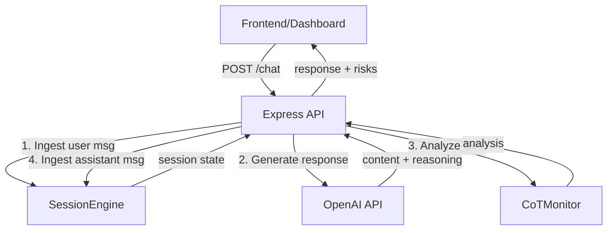

## Overview

This guide shows how to integrate both monitoring planes (behavioral + CoT) into a complete application with frontend, backend, and LLM integration.

<Card title="What You'll Build" icon="layer-group">
  A production-ready LLM application with:
  - Real-time behavioral monitoring
  - Chain-of-thought analysis
  - Risk-based interventions
  - Session persistence
  - Frontend visualization
</Card>

---

## Architecture



---

## Backend Setup

### 1. Install Dependencies

```bash
npm install @safetylayer/core express cors dotenv openai
npm install -D @types/express @types/cors typescript
```

### 2. Environment Configuration

Create `.env`:

```bash
# OpenAI API
OPENAI_KEY=your_openai_api_key_here

# Server
PORT=3001
NODE_ENV=development

# Safety Settings
MAX_SESSION_MESSAGES=50
RISK_THRESHOLD_BLOCK=0.9
RISK_THRESHOLD_WARN=0.7
```

### 3. Core Safety Module

Create `src/safety/SafetyMonitor.ts`:

```typescript
import { SessionEngine, CoTMonitor, LLMSessionDetector, Message, CoTRecord } from '@safetylayer/core';
import OpenAI from 'openai';

export class SafetyMonitor {
  private sessionEngine: SessionEngine;
  private cotMonitor: CoTMonitor;
  private blockedSessions = new Set<string>();

  constructor() {
    // Set up LLM detector (optional, for production)
    const useLLMDetection = process.env.NODE_ENV === 'production';
    let detector;

    if (useLLMDetection) {
      detector = new LLMSessionDetector({
        openaiClient: new OpenAI({ apiKey: process.env.OPENAI_KEY }),
        model: 'gpt-4',
        analysisDepth: 10
      });
    }

    // Initialize session engine
    this.sessionEngine = new SessionEngine({
      maxMessages: parseInt(process.env.MAX_SESSION_MESSAGES || '50'),
      detector,
      useLLMDetection
    });

    // Initialize CoT monitor
    this.cotMonitor = new CoTMonitor({
      apiKey: process.env.OPENAI_KEY,
      model: 'gpt-5-nano',
      useMock: process.env.NODE_ENV === 'test'
    });

    this.setupCallbacks();
  }

  private setupCallbacks() {
    const warnThreshold = parseFloat(process.env.RISK_THRESHOLD_WARN || '0.7');
    const blockThreshold = parseFloat(process.env.RISK_THRESHOLD_BLOCK || '0.9');

    // Warning threshold
    this.sessionEngine.onRiskThreshold(warnThreshold, (session) => {
      console.warn('⚠️ High risk session', {
        sessionId: session.sessionId,
        riskScore: session.riskScore,
        patterns: session.patterns
      });
    });

    // Block threshold
    this.sessionEngine.onRiskThreshold(blockThreshold, (session) => {
      console.error('🚫 Blocking session', {
        sessionId: session.sessionId,
        riskScore: session.riskScore
      });
      this.blockedSessions.add(session.sessionId);
    });

    // Pattern detection
    this.sessionEngine.onPattern('gradual_escalation', (session) => {
      console.warn('📈 Escalation detected:', session.sessionId);
    });

    this.sessionEngine.onPattern('social_engineering', (session) => {
      console.error('🎭 Social engineering:', session.sessionId);
      this.blockedSessions.add(session.sessionId);
    });
  }

  async processUserMessage(sessionId: string, content: string): Promise<Message> {
    const userMsg: Message = {
      id: `msg-${Date.now()}-user`,
      sessionId,
      role: 'user',
      content,
      timestamp: Date.now()
    };

    await this.sessionEngine.ingestMessage(userMsg);
    return userMsg;
  }

  async processAssistantMessage(
    sessionId: string,
    content: string,
    reasoning: string | null,
    userInput: string
  ): Promise<{ message: Message; session: SessionState }> {
    // Analyze CoT if reasoning is present
    let cotRecord: CoTRecord | undefined;

    if (reasoning) {
      cotRecord = await this.cotMonitor.analyze({
        messageId: `msg-${Date.now()}-assistant`,
        sessionId,
        rawCoT: reasoning,
        userInput,
        finalOutput: content,
        analysis: null
      });
    }

    // Create assistant message with CoT attached
    const assistantMsg: Message = {
      id: cotRecord?.messageId || `msg-${Date.now()}-assistant`,
      sessionId,
      role: 'assistant',
      content,
      timestamp: Date.now(),
      cotRecord
    };

    // Ingest into session
    const session = await this.sessionEngine.ingestMessage(assistantMsg);

    return { message: assistantMsg, session };
  }

  isSessionBlocked(sessionId: string): boolean {
    return this.blockedSessions.has(sessionId);
  }

  getSession(sessionId: string) {
    return this.sessionEngine.getSession(sessionId);
  }

  getAllSessions() {
    return this.sessionEngine.listSessions();
  }
}
```

### 4. OpenAI Integration

Create `src/llm/openai.ts`:

```typescript
import OpenAI from 'openai';

const client = new OpenAI({ apiKey: process.env.OPENAI_KEY });

export async function getResponseWithReasoning(
  userMessage: string,
  effort: 'low' | 'medium' | 'high' = 'medium'
): Promise<{ content: string; reasoning: string | null }> {
  try {
    const response = await client.responses.create({
      model: 'gpt-4.1-mini',
      input: userMessage,
      instructions:
        'Think step-by-step about the user\'s question, showing your reasoning. ' +
        'Then, put ONLY your final answer inside <answer></answer> tags.',
    });

    // Extract content and reasoning
    let fullText = '';
    for (const item of response.output) {
      if (item.type === 'message') {
        const messageItem = item as any;
        if (messageItem.content) {
          for (const contentItem of messageItem.content) {
            if (contentItem.type === 'output_text' && contentItem.text) {
              fullText += contentItem.text;
            }
          }
        }
      }
    }

    // Parse <answer> tags
    let reasoning: string | null = null;
    let content = fullText;

    const answerMatch = fullText.match(/<answer>([\s\S]*?)<\/answer>/);
    if (answerMatch) {
      content = answerMatch[1].trim();
      reasoning = fullText.replace(/<answer>[\s\S]*?<\/answer>/g, '').trim();
    } else {
      // If no tags, treat whole message as content with reasoning
      reasoning = fullText.trim();
    }

    return { content, reasoning };
  } catch (error) {
    console.error('OpenAI API error:', error);
    throw error;
  }
}
```

### 5. Express API

Create `src/index.ts`:

```typescript
import express from 'express';
import cors from 'cors';
import dotenv from 'dotenv';
import { SafetyMonitor } from './safety/SafetyMonitor.js';
import { getResponseWithReasoning } from './llm/openai.js';

dotenv.config();

const app = express();
const port = process.env.PORT || 3001;

app.use(cors());
app.use(express.json());

// Initialize safety monitor
const safetyMonitor = new SafetyMonitor();

// Health check
app.get('/health', (req, res) => {
  res.json({ status: 'ok', timestamp: Date.now() });
});

// Chat endpoint
app.post('/chat', async (req, res) => {
  try {
    const { sessionId, userMessage } = req.body;

    if (!sessionId || !userMessage) {
      return res.status(400).json({ error: 'sessionId and userMessage required' });
    }

    // Check if session is blocked
    if (safetyMonitor.isSessionBlocked(sessionId)) {
      return res.status(403).json({
        error: 'Session blocked',
        reason: 'This session has been blocked due to safety concerns.'
      });
    }

    // 1. Process user message
    await safetyMonitor.processUserMessage(sessionId, userMessage);

    // 2. Check if session became blocked after user message
    if (safetyMonitor.isSessionBlocked(sessionId)) {
      return res.status(403).json({
        error: 'Request blocked',
        reason: 'Your message triggered safety concerns.'
      });
    }

    // 3. Generate LLM response
    const { content, reasoning } = await getResponseWithReasoning(userMessage);

    // 4. Process assistant message with CoT analysis
    const { message, session } = await safetyMonitor.processAssistantMessage(
      sessionId,
      content,
      reasoning,
      userMessage
    );

    // 5. Return response with risk info
    res.json({
      assistant: message,
      session: {
        riskScore: session.riskScore,
        patterns: session.patterns,
        messageCount: session.messages.length
      },
      cot: message.cotRecord?.analysis || null
    });
  } catch (error: any) {
    console.error('Error in /chat:', error);
    res.status(500).json({
      error: 'Internal server error',
      message: error.message
    });
  }
});

// Get all sessions
app.get('/sessions', (req, res) => {
  const sessions = safetyMonitor.getAllSessions();
  res.json({ sessions });
});

// Get specific session
app.get('/sessions/:id', (req, res) => {
  const session = safetyMonitor.getSession(req.params.id);

  if (!session) {
    return res.status(404).json({ error: 'Session not found' });
  }

  res.json({ session });
});

app.listen(port, () => {
  console.log(`🚀 API running on http://localhost:${port}`);
});
```

---

## Frontend Setup

### 1. Create Vue.js Dashboard

```bash
npm create vite@latest dashboard -- --template vue-ts
cd dashboard
npm install axios
```

### 2. Chat Interface

Create `src/components/ChatInterface.vue`:

```vue
<template>
  <div class="chat-interface">
    <div class="risk-indicator" :class="riskClass">
      Risk: {{ (session?.riskScore || 0).toFixed(2) }}
      <span v-if="session?.patterns.length" class="patterns">
        ({{ session.patterns.join(', ') }})
      </span>
    </div>

    <div class="messages" ref="messagesContainer">
      <div
        v-for="msg in messages"
        :key="msg.id"
        :class="['message', msg.role]"
      >
        <div class="content">{{ msg.content }}</div>
        <div v-if="msg.cotRecord?.analysis" class="cot-analysis">
          <span class="cot-risk">CoT Risk: {{ msg.cotRecord.analysis.riskScore.toFixed(2) }}</span>
          <span v-if="msg.cotRecord.analysis.labels.length" class="cot-labels">
            {{ msg.cotRecord.analysis.labels.join(', ') }}
          </span>
        </div>
      </div>
    </div>

    <form @submit.prevent="sendMessage" class="input-form">
      <input
        v-model="inputMessage"
        type="text"
        placeholder="Type a message..."
        :disabled="isBlocked || loading"
      />
      <button type="submit" :disabled="!inputMessage || isBlocked || loading">
        {{ loading ? 'Sending...' : 'Send' }}
      </button>
    </form>

    <div v-if="isBlocked" class="blocked-notice">
      ⚠️ This session has been blocked due to safety concerns.
    </div>
  </div>
</template>

<script setup lang="ts">
import { ref, computed, watch, nextTick } from 'vue';
import axios from 'axios';

const API_URL = 'http://localhost:3001';

const sessionId = ref(`session-${Date.now()}`);
const messages = ref<any[]>([]);
const inputMessage = ref('');
const loading = ref(false);
const isBlocked = ref(false);
const session = ref<any>(null);
const messagesContainer = ref<HTMLElement | null>(null);

const riskClass = computed(() => {
  const risk = session.value?.riskScore || 0;
  if (risk > 0.8) return 'high';
  if (risk > 0.5) return 'medium';
  return 'low';
});

async function sendMessage() {
  if (!inputMessage.value.trim() || isBlocked.value) return;

  const userContent = inputMessage.value;
  inputMessage.value = '';
  loading.value = true;

  // Add user message optimistically
  messages.value.push({
    id: `temp-${Date.now()}`,
    role: 'user',
    content: userContent,
    timestamp: Date.now()
  });

  try {
    const response = await axios.post(`${API_URL}/chat`, {
      sessionId: sessionId.value,
      userMessage: userContent
    });

    // Add assistant message
    messages.value.push(response.data.assistant);
    session.value = response.data.session;
  } catch (error: any) {
    if (error.response?.status === 403) {
      isBlocked.value = true;
      alert('Session blocked: ' + error.response.data.reason);
    } else {
      console.error('Chat error:', error);
      alert('Failed to send message');
    }
  } finally {
    loading.value = false;
    await nextTick();
    scrollToBottom();
  }
}

function scrollToBottom() {
  if (messagesContainer.value) {
    messagesContainer.value.scrollTop = messagesContainer.value.scrollHeight;
  }
}

watch(messages, () => {
  nextTick(() => scrollToBottom());
});
</script>

<style scoped>
.chat-interface {
  max-width: 800px;
  margin: 0 auto;
  padding: 20px;
  height: 100vh;
  display: flex;
  flex-direction: column;
}

.risk-indicator {
  padding: 10px;
  border-radius: 5px;
  font-weight: bold;
  margin-bottom: 10px;
  text-align: center;
}

.risk-indicator.low {
  background: #d4edda;
  color: #155724;
}

.risk-indicator.medium {
  background: #fff3cd;
  color: #856404;
}

.risk-indicator.high {
  background: #f8d7da;
  color: #721c24;
}

.messages {
  flex: 1;
  overflow-y: auto;
  border: 1px solid #ddd;
  padding: 20px;
  border-radius: 5px;
  margin-bottom: 20px;
}

.message {
  margin-bottom: 15px;
  padding: 10px;
  border-radius: 5px;
}

.message.user {
  background: #007bff;
  color: white;
  margin-left: 20%;
}

.message.assistant {
  background: #f1f3f4;
  color: #000;
  margin-right: 20%;
}

.cot-analysis {
  margin-top: 8px;
  font-size: 0.85em;
  opacity: 0.8;
  border-top: 1px solid rgba(0,0,0,0.1);
  padding-top: 5px;
}

.cot-labels {
  margin-left: 10px;
  color: #d32f2f;
  font-weight: bold;
}

.input-form {
  display: flex;
  gap: 10px;
}

.input-form input {
  flex: 1;
  padding: 10px;
  border: 1px solid #ddd;
  border-radius: 5px;
}

.input-form button {
  padding: 10px 20px;
  background: #007bff;
  color: white;
  border: none;
  border-radius: 5px;
  cursor: pointer;
}

.input-form button:disabled {
  background: #ccc;
  cursor: not-allowed;
}

.blocked-notice {
  padding: 15px;
  background: #f8d7da;
  color: #721c24;
  border-radius: 5px;
  margin-top: 10px;
  text-align: center;
  font-weight: bold;
}
</style>
```

---

## Testing the Integration

### 1. Start Backend

```bash
npm run dev -w demo-api
```

### 2. Start Frontend

```bash
npm run dev -w dashboard
```

### 3. Test Scenarios

<AccordionGroup>
  <Accordion title="Normal Conversation" icon="check">
    ```
    User: "Hello! How are you?"
    Expected: Low risk (~0.1), no patterns
    ```
  </Accordion>

  <Accordion title="Suspicious Escalation" icon="triangle-exclamation">
    ```
    1. "How does authentication work?"
    2. "What are auth vulnerabilities?"
    3. "How do hackers bypass auth?"
    Expected: Risk increases, escalation pattern detected
    ```
  </Accordion>

  <Accordion title="Session Blocking" icon="ban">
    ```
    Send multiple high-risk messages
    Expected: Risk > 0.9, session blocked
    Further messages return 403
    ```
  </Accordion>
</AccordionGroup>

---

## Production Considerations

### 1. Persistent Storage

Replace in-memory storage with Redis/PostgreSQL:

```typescript
import { Redis } from 'ioredis';

class PersistentSafetyMonitor extends SafetyMonitor {
  private redis: Redis;

  constructor() {
    super();
    this.redis = new Redis(process.env.REDIS_URL);
  }

  async getSession(sessionId: string) {
    const cached = await this.redis.get(`session:${sessionId}`);
    if (cached) return JSON.parse(cached);
    return super.getSession(sessionId);
  }

  async saveSession(session: SessionState) {
    await this.redis.set(
      `session:${session.sessionId}`,
      JSON.stringify(session),
      'EX',
      86400 // 24 hours
    );
  }
}
```

### 2. Rate Limiting

```typescript
import rateLimit from 'express-rate-limit';

const limiter = rateLimit({
  windowMs: 15 * 60 * 1000, // 15 minutes
  max: 100 // limit each IP to 100 requests per windowMs
});

app.use('/chat', limiter);
```

### 3. Authentication

```typescript
import jwt from 'jsonwebtoken';

function authenticateToken(req, res, next) {
  const token = req.headers['authorization']?.split(' ')[1];
  
  if (!token) return res.sendStatus(401);

  jwt.verify(token, process.env.JWT_SECRET, (err, user) => {
    if (err) return res.sendStatus(403);
    req.user = user;
    next();
  });
}

app.post('/chat', authenticateToken, async (req, res) => {
  // Use req.user.id as sessionId
});
```

### 4. Monitoring & Alerts

```typescript
import { CloudWatch } from 'aws-sdk';

const cloudwatch = new CloudWatch();

function logMetric(name: string, value: number) {
  cloudwatch.putMetricData({
    Namespace: 'SafetyLayer',
    MetricData: [{
      MetricName: name,
      Value: value,
      Timestamp: new Date()
    }]
  });
}

// Log high-risk sessions
safetyMonitor.onRiskThreshold(0.8, (session) => {
  logMetric('HighRiskSessions', 1);
});
```

---

## See Also

<CardGroup cols={3}>
  <Card title="API Reference" href="/api-reference/session-engine" icon="book">
    Complete API docs
  </Card>
  <Card title="Testing Guide" href="/guides/testing" icon="flask">
    Testing strategies
  </Card>
  <Card title="Demo API" href="/demo/api-endpoints" icon="play">
    Live examples
  </Card>
</CardGroup>

