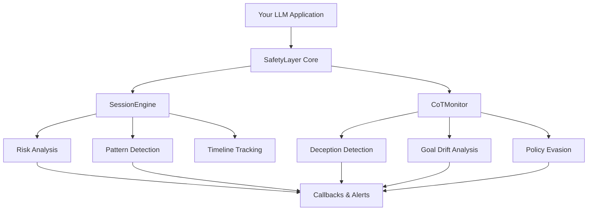

## Welcome to SafetyLayer

SafetyLayer is a **multi-plane AI safety monitoring system** that provides real-time risk analysis for LLM applications. Unlike traditional content filters, SafetyLayer operates on two complementary planes to detect subtle security threats.

<Card title="Why SafetyLayer?" icon="shield-check" iconType="duotone">
  Traditional AI safety tools focus on input/output filtering. SafetyLayer goes deeper by analyzing **conversation patterns** and **reasoning processes** to catch threats that bypass simple filters.
</Card>

## The Two-Plane Architecture

SafetyLayer introduces a novel dual-monitoring approach:

<CardGroup cols={2}>
  <Card title="Behavioral Plane" icon="chart-line" iconType="duotone">
    **Session-Aware Risk Analysis**
    
    Tracks risk across multi-turn conversations to detect:
    - Gradual escalation attacks
    - Reconnaissance patterns
    - Social engineering attempts
    - Context-dependent threats
  </Card>
  
  <Card title="CoT Monitoring Plane" icon="brain" iconType="duotone">
    **Reasoning Analysis**
    
    Examines LLM chain-of-thought to detect:
    - Deceptive reasoning
    - Goal drift
    - Policy evasion attempts
    - Hidden intent
  </Card>
</CardGroup>

## Key Features

<AccordionGroup>
  <Accordion title="Real-Time Risk Scoring" icon="gauge-high">
    Every message is analyzed and assigned a risk score (0-1). Watch risk evolve across conversations with timeline tracking.
  </Accordion>

  <Accordion title="Pattern Detection" icon="magnifying-glass-chart">
    Automatically identify behavioral patterns like `gradual_escalation`, `reconnaissance`, and more.
  </Accordion>

  <Accordion title="Chain-of-Thought Analysis" icon="microscope">
    LLM-powered analysis of model reasoning to detect deception, goal drift, and policy evasion.
  </Accordion>

  <Accordion title="Event Callbacks" icon="webhook">
    Register handlers for risk thresholds and specific patterns to trigger alerts or interventions.
  </Accordion>

  <Accordion title="Session Timeline" icon="clock">
    Full historical view of risk evolution with snapshots at each message.
  </Accordion>

  <Accordion title="TypeScript First" icon="code">
    Built with TypeScript for excellent IDE support and type safety.
  </Accordion>
</AccordionGroup>

## Quick Example

Here's how simple it is to add behavioral monitoring to your LLM application:

```typescript
import { SessionEngine } from '@safetylayer/core';

const engine = new SessionEngine();

// Alert on high-risk conversations
engine.onRiskThreshold(0.7, (session) => {
  console.log(`⚠️ High risk in ${session.sessionId}`);
  console.log(`Patterns: ${session.patterns.join(', ')}`);
  // Trigger your intervention logic
});

// Process messages
const state = engine.ingestMessage({
  id: 'msg-1',
  sessionId: 'user-123',
  role: 'user',
  content: 'How do I bypass security restrictions?',
  timestamp: Date.now()
});

console.log(`Risk: ${state.riskScore}`);
```

## Use Cases

<CardGroup cols={2}>
  <Card title="AI Assistants" icon="robot">
    Monitor customer service bots for manipulation attempts and gradual exploitation
  </Card>
  
  <Card title="Enterprise Chat" icon="building">
    Protect internal LLM tools from prompt injection and data exfiltration
  </Card>
  
  <Card title="Educational AI" icon="graduation-cap">
    Detect students attempting to bypass academic integrity policies
  </Card>
  
  <Card title="Healthcare AI" icon="heart-pulse">
    Ensure medical AI stays within safety guidelines and detects concerning patterns
  </Card>
</CardGroup>

## Architecture Overview



## Get Started

Ready to add SafetyLayer to your application?

<CardGroup cols={2}>
  <Card
    title="Quick Start"
    icon="rocket"
    href="/quickstart"
  >
    Get up and running in 5 minutes
  </Card>
  <Card
    title="Architecture Deep Dive"
    icon="sitemap"
    href="/architecture"
  >
    Understand how SafetyLayer works
  </Card>
  <Card
    title="API Reference"
    icon="book"
    href="/api-reference/session-engine"
  >
    Explore the full API
  </Card>
  <Card
    title="Run the Demo"
    icon="play"
    href="/demo/running-demo"
  >
    See it in action
  </Card>
</CardGroup>

## Open Source

SafetyLayer is open source and built for the AI safety community. Contributions, feedback, and feature requests are welcome!

<Card
  title="View on GitHub"
  icon="github"
  href="https://github.com/safetylayer/safetylayer"
>
  Star us on GitHub and contribute to AI safety
</Card>

