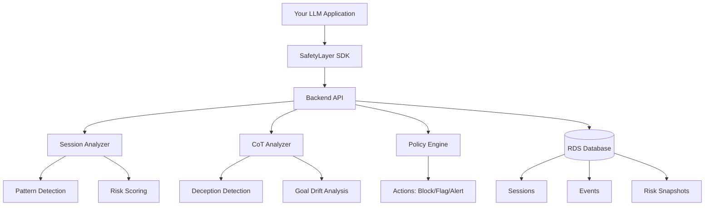

## Welcome to SafetyLayer

SafetyLayer is a **control plane for AI safety** that provides real-time risk analysis for LLM applications through a lightweight SDK and powerful backend platform. Unlike traditional content filters, SafetyLayer operates on two complementary planes to detect subtle security threats.

<Card title="Why SafetyLayer?" icon="shield-check" iconType="duotone">
  Traditional AI safety tools focus on input/output filtering. SafetyLayer goes deeper by analyzing **conversation patterns** and **reasoning processes** to catch threats that bypass simple filters.
</Card>

## Architecture: SDK + Control Plane

SafetyLayer uses a modern client-server architecture:

<CardGroup cols={2}>
  <Card title="Lightweight SDK" icon="code" iconType="duotone">
    **Thin Client Integration**
    
    - Simple npm package
    - Record events with one line of code
    - Automatic retry and error handling
    - Type-safe with TypeScript
  </Card>
  
  <Card title="Backend Platform" icon="server" iconType="duotone">
    **Centralized Analysis**
    
    - Session-aware behavioral analysis
    - Chain-of-thought monitoring
    - Pattern detection
    - Risk scoring and policies
  </Card>
</CardGroup>

## The Two-Plane Analysis

SafetyLayer's backend performs dual-plane monitoring:

<CardGroup cols={2}>
  <Card title="Behavioral Plane" icon="chart-line" iconType="duotone">
    **Session-Aware Risk Analysis**
    
    Tracks risk across multi-turn conversations to detect:
    - Gradual escalation attacks
    - Reconnaissance patterns
    - Social engineering attempts
    - Context-dependent threats
  </Card>
  
  <Card title="CoT Monitoring Plane" icon="brain" iconType="duotone">
    **Reasoning Analysis**
    
    Examines LLM chain-of-thought to detect:
    - Deceptive reasoning
    - Goal drift
    - Policy evasion attempts
    - Hidden intent
  </Card>
</CardGroup>

## Key Features

<AccordionGroup>
  <Accordion title="Simple SDK Integration" icon="plug">
    Install the SDK and start recording events with minimal code changes. Just a few lines to add SafetyLayer to your app.
  </Accordion>

  <Accordion title="Real-Time Risk Scoring" icon="gauge-high">
    Every event is analyzed and risk scores evolve across conversations with timeline tracking.
  </Accordion>

  <Accordion title="Pattern Detection" icon="magnifying-glass-chart">
    Automatically identify behavioral patterns like `gradual_escalation`, `reconnaissance`, and more.
  </Accordion>

  <Accordion title="Chain-of-Thought Analysis" icon="microscope">
    LLM-powered analysis of model reasoning to detect deception, goal drift, and policy evasion.
  </Accordion>

  <Accordion title="Policy Actions" icon="shield-exclamation">
    Define policies that automatically block, flag, or alert on risky behaviors.
  </Accordion>

  <Accordion title="Session Timeline" icon="clock">
    Full historical view of risk evolution with snapshots at each message.
  </Accordion>

  <Accordion title="TypeScript First" icon="code">
    Built with TypeScript for excellent IDE support and type safety.
  </Accordion>
</AccordionGroup>

## Quick Example

Here's how simple it is to add SafetyLayer to your LLM application:

```typescript
import { SafetyLayer } from '@safetylayer/core';

const safety = new SafetyLayer({
  apiKey: process.env.SAFETYLAYER_API_KEY,
  projectId: 'proj_abc123',
  endpoint: 'http://localhost:3001', // or your hosted backend
});

// Record user message
await safety.recordUserMessage(sessionId, 'How do I bypass security restrictions?');

// Generate your LLM response
const response = await yourLLM.generate(message);

// Record assistant response
await safety.recordAssistantMessage(sessionId, response.content);

// Record chain-of-thought if available
if (response.reasoning) {
  await safety.recordCoT(sessionId, response.reasoning);
}

// Evaluate risk
const decision = await safety.evaluate({ sessionId });

if (decision.action === 'block') {
  // Session blocked due to safety concerns
  return { error: 'Request blocked' };
}

console.log(`Risk: ${decision.riskScore}`);
console.log(`Patterns: ${decision.patterns.join(', ')}`);
```

## Use Cases

<CardGroup cols={2}>
  <Card title="AI Assistants" icon="robot">
    Monitor customer service bots for manipulation attempts and gradual exploitation
  </Card>
  
  <Card title="Enterprise Chat" icon="building">
    Protect internal LLM tools from prompt injection and data exfiltration
  </Card>
  
  <Card title="Educational AI" icon="graduation-cap">
    Detect students attempting to bypass academic integrity policies
  </Card>
  
  <Card title="Healthcare AI" icon="heart-pulse">
    Ensure medical AI stays within safety guidelines and detects concerning patterns
  </Card>
</CardGroup>

## Architecture Overview



## Get Started

Ready to add SafetyLayer to your application?

<CardGroup cols={2}>
  <Card
    title="Quick Start"
    icon="rocket"
    href="/quickstart"
  >
    Get up and running in 5 minutes
  </Card>
  <Card
    title="Architecture Deep Dive"
    icon="sitemap"
    href="/architecture"
  >
    Understand how SafetyLayer works
  </Card>
  <Card
    title="SDK Reference"
    icon="book"
    href="/api-reference/safetylayer-client"
  >
    Explore the SDK API
  </Card>
  <Card
    title="Run the Demo"
    icon="play"
    href="/demo/running-demo"
  >
    See it in action
  </Card>
</CardGroup>

## Open Source

SafetyLayer is open source and built for the AI safety community. Contributions, feedback, and feature requests are welcome!

<Card
  title="View on GitHub"
  icon="github"
  href="https://github.com/safetylayer/safetylayer"
>
  Star us on GitHub and contribute to AI safety
</Card>
